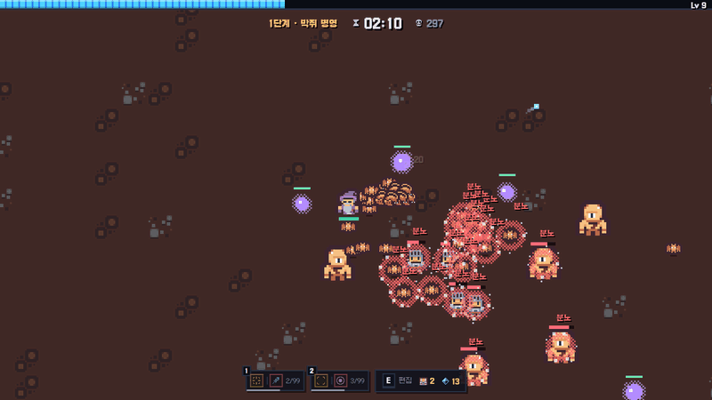
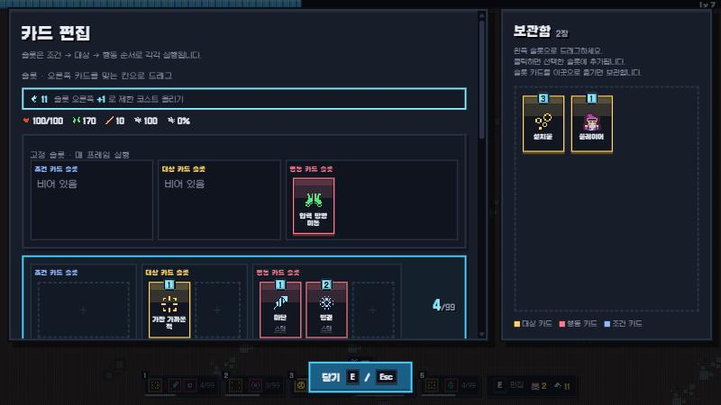
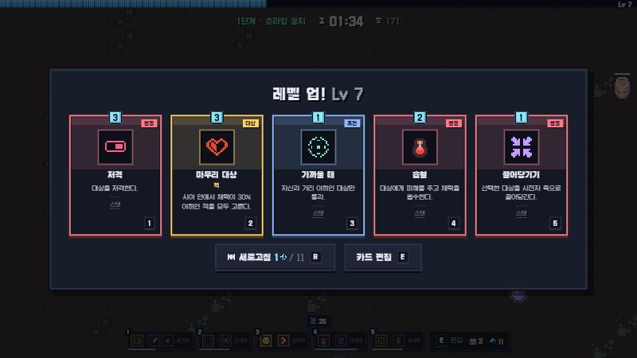
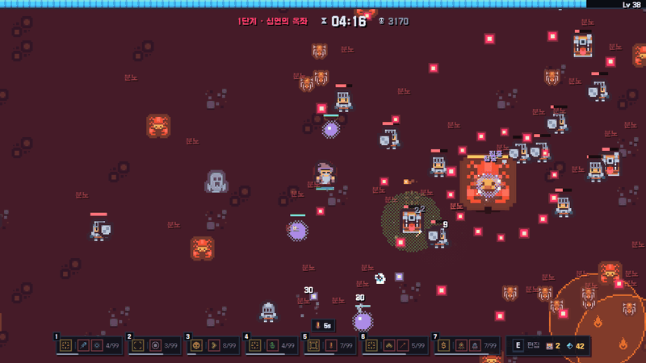

<div align="center">

# 🔁 Spell Loop

**카드를 쌓아 나만의 주문을 조립하고, 몬스터 무리에서 살아남는 로그라이크 서바이벌**

[▶ 지금 플레이](https://ybs1164.github.io/spellLoop/) · [상세 규칙](docs/MECHANICS.md)




</div>

## 🎯 게임 목표

- 한 판은 **3단계**로 진행됩니다. 단계마다 테마 스테이지 8종 중 하나가 무작위로 정해집니다.
- 시간이 지나면 **보스**가 등장합니다. 쓰러뜨리면 다음 단계로, **3단계 보스를 쓰러뜨리면 승리**입니다.
- 몰려오는 적을 처치해 경험치를 모으고, 체력이 0이 되기 전에 빌드를 완성하세요.

## 🕹️ 무엇을 할 수 있나

| 조작 | 키 |
| --- | --- |
| 이동 | `W` `A` `S` `D` / 방향키 |
| 카드 편집 | `E` / `Tab` |
| 일시정지 | `Esc` |
| 레벨업 카드 선택 | `1` `2` `3` |
| 성능 오버레이 | `F3` |

**공격은 자동입니다.** 플레이어는 이동과 **카드 조합**에 집중합니다. 슬롯에 놓은 카드가 쿨타임마다 알아서 발동합니다.

### 🃏 카드로 주문 만들기



모든 슬롯은 **조건 → 대상 → 행동** 세 칸으로 나뉘며 이 순서로 실행됩니다.

| 칸 | 역할 | 예시 |
| --- | --- | --- |
| 조건 | 언제 발동할지 | `부상일 때`, `적이 근처일 때`, `사망 시` |
| 대상 | 누구에게 쓸지 | `가장 가까운 적`, `마무리 대상`, `전체`, `자신` |
| 행동 | 무엇을 할지 | `탄환`, `빙결`, `연쇄`, `치유`, `보호막`, `흡수`, `분열` |

조합 예시:

- `가장 가까운 적 → 저격` — 가까운 적 하나를 정밀 사격
- `부상일 때 → 자신 → 치유` — 다쳤을 때만 스스로 회복
- `표식이 있을 때 → 적 → 저격` — 표식을 단 적만 골라 처치
- `사망 시 → 슬롯 주인 → 폭발` — 죽는 순간 폭발

### ⬆️ 성장



- 레벨업마다 **카드 3~5장 중 하나**를 고르고 코스트 포인트 +1을 얻습니다.
- 코스트 포인트 3으로 **슬롯을 확장**합니다(최대 6개).
- 카드 편집기에서 슬롯 구성을 언제든 바꿔 빌드를 재설계할 수 있습니다.
- 아군·설치물(포탑, 미끼, 지뢰 등)을 소환하는 것도 전략입니다.

### 👹 보스와 스테이지



| 단계 | 스테이지 (보스) |
| --- | --- |
| 1 | 슬라임 둥지 (슬라임 왕) · 이끼 온실 (재생의 모체) · 박쥐 병영 (군단의 지휘자) |
| 2 | 망자의 묘역 (망령 군주) · 봉인된 성소 (속박의 예언자) · 철벽 요새 (철벽의 수문장) |
| 3 | 잿불 화구 (잿불의 폭군) · 심연의 옥좌 (심연 군주) |

보스는 출현 배너에 공략 힌트가 뜨고, 일시정지 화면과 **도감**에서 다시 볼 수 있습니다. 화약통과 달아나는 보물 상자 같은 변수도 숨어 있습니다.

## 🚀 실행

설치 없이 저장소를 내려받아 `index.html`을 브라우저로 열면 됩니다(순수 JS·Canvas).

```bash
git clone https://github.com/ybs1164/spellLoop.git
```

## 📚 더 보기

- [상세 규칙·개발 노트](docs/MECHANICS.md) — 슬롯 실행, 쿨타임 계산, 검증 스크립트
- [리소스 출처](assets/CREDITS.md)
